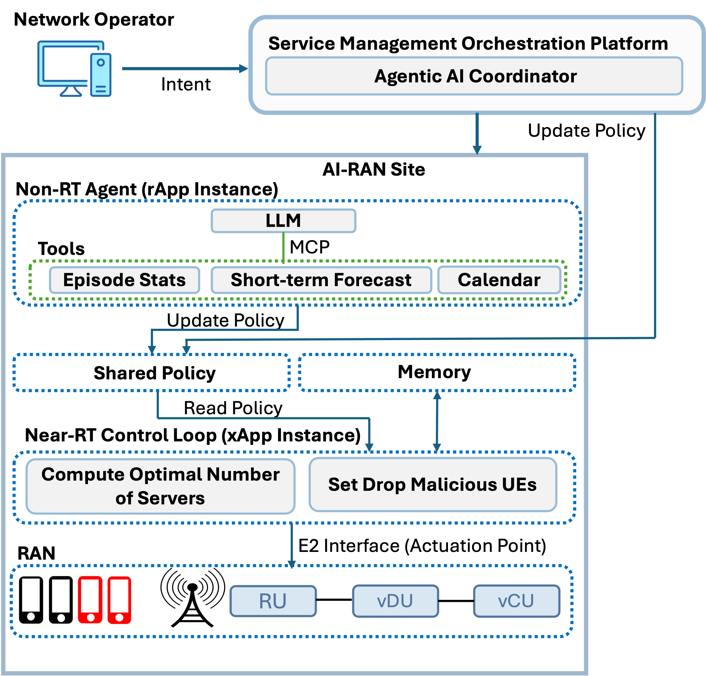
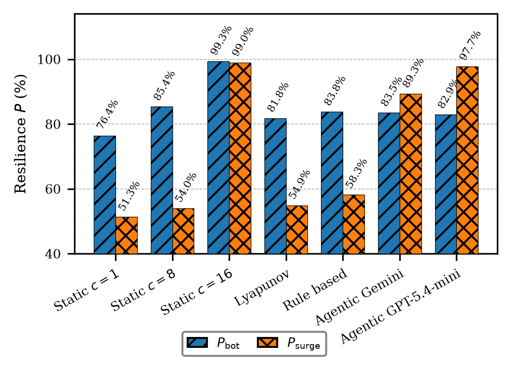

# AI-for-RAN Resilience

A three-tier **agentic AI** framework for signaling-storm resilience in Open RAN / AI-RAN: an SMO orchestrator turns operator intent into policy, a per-site LLM agent anticipates and judges storms, and a deterministic fast loop enforces every decision — with no language model on the real-time control path.

---

## Overview

A signaling storm occurs when a burst of UE attach requests overwhelms the control-plane processing capacity of a CU/DU. Retries amplify the load in a self-reinforcing loop — behaviour that analytical M/M/c models cannot capture. This repository contains the framework internals:

- A discrete-event simulator (`sim/`) that reproduces the storm dynamics, calibrated to the Open RAN delay model from [arXiv:2505.00605](https://arxiv.org/abs/2505.00605).
- A **three-tier agentic control system** (`agents/`) that keeps the network resilient during a storm.

---

## Architecture — three-tier agentic design

<p align="center">
  
</p>

A network operator issues intents to an **SMO Agentic AI Coordinator**; a **per-site Non-RT LLM agent** (the storm judge) reads telemetry through MCP tools (episode stats, short-term forecast, scheduled-event calendar), writes a **shared policy**, and carries **cross-episode memory**; and a **deterministic Near-RT fast loop** enforces the result (optimal server count + malicious-UE drop) with no LLM on the tick. In code these map to three actors above the fast loop:

```
 Orchestrator (code coordinator)   starts the episode, launches the loops,
                                    routes operator intents; idle otherwise.

 Non-RT-Agent (LLM, ~10 s cadence)  the STORM JUDGE. Reads a telemetry *window*
                                    (trends, not one instant), decides storm-vs-
                                    noise, and writes storm_active + malicious_drop_prob
                                    into shared policy. Never blocks the fast loop.

 Fast control loop (pure code, 1 Hz)  reads telemetry, computes the Lyapunov-optimal
                                      server count, reads the policy snapshot, clamps,
                                      and actuates. NO LLM on the tick.
```

The key idea: **capacity adapts reactively every second** (the fast loop always
follows `c_star`), while **only the malicious-UE filter waits on the LLM's storm
verdict**. Filtering is the one lever that benefits from judgment; capacity never
waits for it.

---

## Key results

Resilience is treated as a **lifecycle** — anticipation, absorption, adaptation, recovery, evolution — and the agentic controller is evaluated against static, reactive (Lyapunov), and rule-based baselines on a scenario that pairs an adversarial botnet with a scheduled benign crowd.

<p align="center">
  
</p>

- **Anticipation is decisive.** By reading a scheduled event from a calendar and provisioning *ahead* of it, the agentic controller matches a fully provisioned pool while holding only **~a quarter of its capacity** (≈3.5–4.2 vs 16 servers) — **3–4× the capacity efficiency**. Reactive controllers, which act only once load is visible, serve barely half of the event surge.
- **The model reasons about unseen load.** From a free-text calendar line with no attendance given, the Non-RT agent infers a crowd of **~82k against a true 83.7k** and sizes a **12.4-server reserve against the ideal 13**.
- **Operator intents are actionable.** Free-text intents ground into control directives at **98.4% accuracy** (94.2% exact-match on every lever), and a single instruction reshapes live behaviour end to end.
- **Speed vs capability trade-off.** The deployable `gemini-3.1-flash-lite` flags a botnet in **~8 s** vs `gpt-5.4-mini`'s ~29 s, while the reasoning model absorbs the hardest event-plus-contention window more gently — the two operating points carried forward.
- **Honest limits.** Shared-compute contention shifts a hard stability cliff, so even a correctly provisioned controller loses resilience it cannot observe; and language-model reasoning adds latency and cost, quantified per decision.

Per-experiment data, figures, and reproduce commands live in [`experiments/`](experiments/).

---

## Repository layout

```
agents/                         the three actors (nothing else lives here)
├── orchestrator.py             starts the episode, launches loops, routes operator intents
├── non_rt_agent.py             LLM storm judge — telemetry-window trends → PolicyUpdate
└── near_rt_control_loop.py     PURE-CODE 1 Hz loop — c_star + policy → clamp → actuate

shared/                         state + tool backends shared across tiers (not actors)
├── policy.py                   SharedPolicy (judge↔loop handoff) + EpisodeStats
├── forecast.py                 λ-regression behind the get_forecast MCP tool
├── event_calendar.py           scheduled-event data behind the get_calendar MCP tool
├── storm_memory.py             learned storm-signature (within/across-episode learning)
└── policy_store.py             persists tuned knobs + signature between episodes

mcp_server/
└── server.py                   hosts the running episode (SimHost) + the 3 MCP read tools

sim/                            the simulator (the "world"; no AI) — see sim/README.md
├── config.py                   SimConfig, Open RAN architecture, traffic schedules
├── simulator.py                StormSim: SimPy engine, real-time capable
├── controllers.py              shared lyapunov_optimal_c() + Fixed/Lyapunov baselines
├── metrics.py                  utility u(t) and the A3RT resilience score P
└── README.md                   per-file / per-component guide to sim/

prompts/
├── non_rt_agent_system_prompt.md   full-system storm-judge prompt (default; scheduled-reserve)
├── non_rt_agent_system_prompt_v1.md / _v2.md   archived judge-prompt versions
└── orchestrator.md             operator-intent prompt

scripts/
├── run.py                      full-system episode CLI (Orchestrator → run_episode)
├── run_near_rt.py              bare fast-loop + judge runner (no Orchestrator)
├── exp_1_model_comparison.py         Experiment 1 — LLM model comparison (choose the judge)
├── exp_2_system_comparison.py        Experiment 2 — baselines vs full agentic system
├── exp_3_reserve_sizing.py           Experiment 3 — event-portfolio reserve sizing (attendance estimation)
├── exp_4_V_W_tuning.py               Experiment 4 — V/W × provisioning-delay sweep (benign step vs ramp)
├── exp_5_compute_contention.py       Experiment 5 — compute-contention sensitivity (shared vCU/vDU pool)
├── exp_6_intents.py                  Experiment 6 — operator-intent grounding (exp_6_demo.py = end-to-end posture demo)
├── exp_7_cascading.py                Experiment 7 — cascading stressors (botnet + event + contention in one episode)
├── exp_8_multisite.py                Experiment 8 — concurrent multi-site fleet, SMO routes operator intents
├── exp_detect_recover.py             resilience timeline — time-to-detect + time-to-recover (GPT vs Gemini)
├── ablation.py                       mechanism ablation (forecast / calendar / learning) — retired from the paper, kept as a diagnostic
└── gui.py                      live GUI viewer of a running episode

# per-experiment figure scripts live inside each experiment's folder, e.g.
#   experiments/exp3_reserve_sizing/plot_reserve_sizing.py
#   experiments/exp4_vw_tuning/plot_vw_tuning.py

experiments/                    curated results per experiment (data, figures)
├── README.md                   campaign index (Experiments 1–8)
├── exp1_model_comparison/      Exp 1 — LLM judge selection
├── exp2_system_comparison/     Exp 2 — baselines vs the agentic system
├── exp3_reserve_sizing/        Exp 3 — event-portfolio reserve sizing
├── exp4_vw_tuning/             Exp 4 — V/W × provisioning-delay sweep
├── exp5_compute_contention/    Exp 5 — shared-compute contention
├── exp6_intents/               Exp 6 — operator-intent grounding
├── exp7_cascading/             Exp 7 — cascading stressors
├── exp8_multisite/             Exp 8 — multi-site fleet
└── detect_recover/             resilience timeline (time-to-detect + time-to-recover)

runtime.py                      SimHost — owns the running episode; every tier reads it
STRUCTURE.md                    detailed directory map (source of truth for layout)
FEATURES.md                     catalog of everything the system models
```

---

## The two control levers

The simulator exposes two runtime actuators, mapped to the two resilience mechanisms:

- **Adaptation — `set_servers(c)`**: the commanded server count. Driven every tick by the fast loop from the Lyapunov-optimal `c_star`. A guardrail refuses to shed servers while the queue is still draining.
- **Absorption — `set_malicious_drop_prob(p)`**: fraction of botnet UEs dropped at admission. Gated by the Non-RT judge's `storm_active` verdict (`malicious_drop_prob` during a storm, `0.0` otherwise).

Resilience is scored with the A3RT metric **P = 0.4·absorption + 0.4·adaptation + 0.2·trec**.

---

## Fast-loop control flow

```
every 1 s (no LLM):
    s       = latest telemetry sample
    c_star  = lyapunov_optimal_c(s, ...)          # Python, in-process
    pol     = policy.snapshot()                   # atomic: storm_active, drop_floor
    action  = (servers = c_star,                  # capacity always reactive
               drop    = pol.malicious_drop_prob if pol.storm_active else 0.0)
    apply_decision(sim, action, pol.malicious_drop_prob)   # clamp + actuate
```

---

## Dependencies

- [SimPy](https://simpy.readthedocs.io/) — discrete-event simulation
- [pydantic-ai](https://ai.pydantic.dev/) — LLM agent framework (Non-RT judge)
- [FastMCP](https://github.com/jlowin/fastmcp) — MCP server exposing `get_episode_stats`

The Non-RT judge runs with any OpenAI-compatible model via OpenRouter. The paper uses `openai/gpt-5.4-mini` (reasoning on) and the deployable `google/gemini-3.1-flash-lite`.
